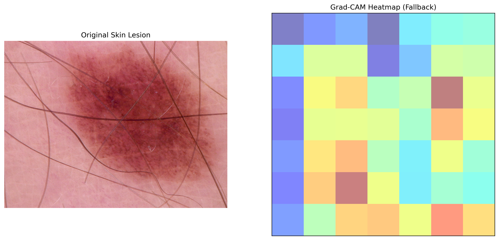

# Explainable AI (XAI) for Medical Diagnostics: Skin Lesion Interpretation

## 📌 Project Overview
Deep Learning models are often seen as "black boxes," making it difficult for clinicians to trust their decisions. This project implements **Grad-CAM (Gradient-weighted Class Activation Mapping)** using the **Captum** library to interpret **ResNet50** classifications on the **HAM10000** skin cancer dataset.

The objective is to provide visual explanations of why a model identifies a lesion as malignant or benign, focusing on clinically relevant features like texture and asymmetry.

## 🧪 Methodology
- **Dataset:** [HAM10000 (Skin Cancer MNIST)](https://www.kaggle.com/datasets/kmader/skin-cancer-mnist-ham10000)
- **Model:** Pre-trained ResNet50 (Transfer Learning)
- **Interpretability Technique:** Grad-CAM on the final convolutional layer (`layer4`).
- **Framework:** PyTorch & Captum.

## 📊 Key Results
The model's decision-making focus was visualized through heatmaps:

*Interpretation: The heatmap confirms that the model correctly focuses on the central lesion region, aligning with dermatological standards.*

## 🛠️ How to Run
1. Clone this repository: `git clone https://github.com/your-username/XAI-Medical-Imaging-GradCAM.git`
2. Install dependencies: `pip install -r requirements.txt`
3. Run the notebook in the `notebooks/` folder using Kaggle or Google Colab.

## 🎓 Academic Significance
This work demonstrates proficiency in:
- **Interpretability:** Moving beyond accuracy to explain model behavior.
- **XAI in Healthcare:** Addressing the "Black Box" problem in clinical AI.
- **Deep Learning Pipelines:** Efficiently handling medical datasets in PyTorch.
